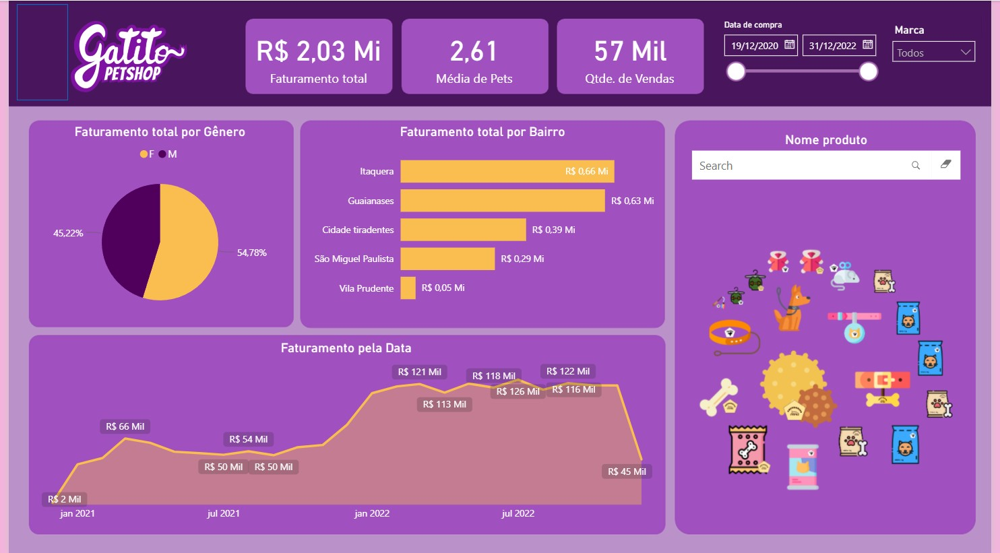

# GatitoPetSHOP
# 📊 Dashboard Petshop | Power BI

Dashboard desenvolvido no Power BI com foco em análise de vendas, faturamento e comportamento de clientes de um petshop fictício.

O projeto foi criado com o objetivo de praticar visualização de dados, organização de indicadores e construção de dashboards interativos voltados para tomada de decisão.

---

## 🚀 Funcionalidades

- Análise de faturamento total
- Quantidade de vendas realizadas
- Média de pets por compra
- Filtro por período
- Filtro por marca
- Ranking de faturamento por bairro
- Evolução do faturamento ao longo do tempo
- Distribuição de faturamento por gênero

---

## 🛠️ Tecnologias utilizadas

- Power BI
- Power Query
- DAX
- Excel / CSV

---

## 📷 Preview

---

## 📈 Objetivo do projeto

Desenvolver habilidades em:
- Modelagem de dados
- Criação de KPIs
- Storytelling com dados
- Visualização de informações
- Construção de dashboards interativos

---

## 📌 Observações

Este projeto possui finalidade educacional e foi desenvolvido para composição de portfólio.
